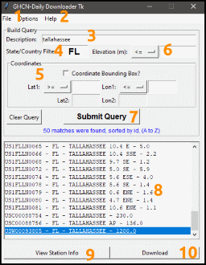

## GHCN-Daily Downloader Tk -- v1.0

`GHCN-Daily Downloader Tk` is a python tkinter zipapp that expedites the retrieval of GHCN (Global Historical Climatology Network)-Daily weather-station data. In addition to filtered queries, the user can request directly downloading the data. Prior to downloading, the user can also inspect information specific to the weather station, including data-ranges (relative to release of this program).

There is data available for over 118,000 weather stations (csv's in gzip format). But without assistance of a program like this, the process of getting this data is drawn-out and cumbersome. This app eliminates a lot of that frustration.

### Contents

* [Requirements and Installation](#requirements-and-installation)
* [How to Use](#how-to-use)
* [Roadmap](#roadmap)
* [Credits/Links](#credits)

### Requirements and Installation

1. You must have Python (`>= 3.5`) with the `tkinter` package installed.
2. Download the following files and (preferably) place in a dedicated clean directory.
  - This zip archive contains 2 primary and required files:
    - `ghcn-daily-downloader-tk.pyz`: This is the app. Run it like you would any other program.
	- `GHCNDaily.db.gz`: This contains the required `sqlite3` database, which houses all needed weather station information sufficient to run queries and request downloading.

[&#8679; back to Contents](#contents)

### How To Use

- When running the app the first time, the user will be notified about the requirement to access Temporary Files, which is only needed during the operation of the program. As long as it is agreed to, the app will then load.
- The app will also create a file called `ghcnd.ini` in the directory from where the app is running. This will automatically save changes from the options menu to remember on successive sessions of the app.
- Each search field/filter is optional but can be combined with other filters.

  1. Options Menu
    - Modify how search-results are displayed
    - As URL's for weather station data won't change, the default method is to simply overwrite data when requesting to download a file that you also had requested days before. Disable that option to append the download time to the saved file.
  2. Help Menu
    - For convenience, the user can take a look a lists of abbreviations of countries and states used in the database (to assist in filtering results, if needed).
  3. Description/Name Entry
    - Each station is assigned a name. This is where you put in something to search (like a city name or something to help narrow the search).
	- Regular Expressions are accepted
	- :airplane: to isolate search results to airports, this regular expression will help: `airport|\bAP\b|\bINTL\b` :airplane:
	    - This will match stations that have `airport`, `AP`, or `INTL` in their names/descriptions as individual words. This is why the `\b` is necessary: to discriminate against stations whose names have `AP` in them but are surrounded by other letters, like `CAPE HATTERAS`. A general search for `AP` in the US will yield nearly 2000 matches. The discriminate search listed above will narrow them to less than 950.
	    - a significant majority of USA airport-based stations use `AP` as a designator.
  4. State/Country Filter
    - If you want to narrow your search results to a specific country or state, put its abbreviation in this field. See the `Help` menu for lists of acceptable abbreviations.
	    - State abbreviations are primarily exclusive for US state and Canadian provinces.
  5. Coordinates and Optional Bounding-Box
    - No Bounding Box
	    - Indicate a valid latitude and/or longitude and change the sign-indicators as desired.
	      - For example, you could narrow your search to stations north of 80-deg N. by putting `80` in the field and select `>=` for the associated sign.
	- With Bounding Box
	    - With this option checked, the user must put in 2 latitude and longitude values. These coordinates can be thought of as forming a box. Any station whose location occurs inside the geographic region specified will be a match (as long as it also meets other requested criterium).
  6. Elevation
    - Narrow your search to stations at and above or below a specified elevation (in meters).
  7. Submit Query Button
    - Once you've built your query, you can then run it via this button. This button will be disabled until there is a proper query built.
	- A convenience button to clear the query is available on the left.
	- The quantity of results found via a query will be displayed underneath this button.
  8. Search Results
    - A list of matching weather stations will appear here.
	    - The user is given a brief overview of the station, including station id, state, name (description), and file size (in KB).
		- The file size is included to give the user a general idea of how much data is in the file (the larger the file, the more data it will have).
  9. Station Information
    - When a search result has been selected, click this button to see a comprehensive list of information relative to the station, including data-ranges for the 5 core GHCN-daily attributes: `PRCP`, `SNOW`, `SNWD`, `TMAX`, and `TMIN`
  10. Download
    - Select the file you want to download and click this button!

[&#8679; back to Contents](#contents)

### Roadmap
- [ ] support downloading multiple files?
- [ ] explicit state-only checkbutton (as there are instances of some country codes shared by state codes)?
- [ ] keep same station selected upon dynamic resort?
- [ ] put state and elevation on same line in a frame?

[&#8679; back to Contents](#contents)

### Credits

- **GHCN-Daily Downloader Tk**, &copy;2022, Kyle Gentry
    - This program is released under the MIT License
    - The author has no association with NOAA
- Database was generated via python using information from [https://www1.ncdc.noaa.gov/pub/data/ghcn/daily/](https://www1.ncdc.noaa.gov/pub/data/ghcn/daily/):
    - `readme.txt` : overview of how to use most of the following files
    - `ghcnd-stations.txt` : Individual Station Information
    - `ghcnd-inventory.txt` : Available Data and ranges/scopes for the individual weather stations
    - `ghcnd-countries.txt` : The country codes (abbreviations) used in GHCN-Daily station ID's
    - `ghcnd-states.txt` : The state/province codes (abbreviations) used in GHCN-Daily station metadata
	- `by_station/` : Directory that contains all individual weather-station gzip files that are updated frequently. This is where downloads are pulled from. Though it's simply an HTML directory list of available files, **it's not recommended visiting this URL as it is hefty in size (around 17MB)**.
- GHCN-Daily Citation: `Menne, M.J., I. Durre, B. Korzeniewski, S. McNeal, K. Thomas, X. Yin, S. Anthony, R. Ray, R.S. Vose, B.E.Gleason, and T.G. Houston, 2012: Global Historical Climatology Network - Daily (GHCN-Daily), Version 3.26.`
- Please visit [NCDC - Climate Data Online](https://www.ncdc.noaa.gov/cdo-web/) to request this data prepared in other formats, like PDF, or a more human-readable CSV format.

[&#8679; back to Contents](#contents)

